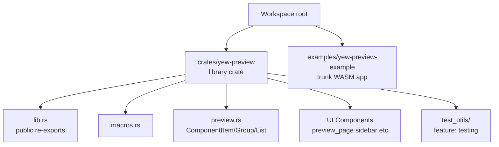
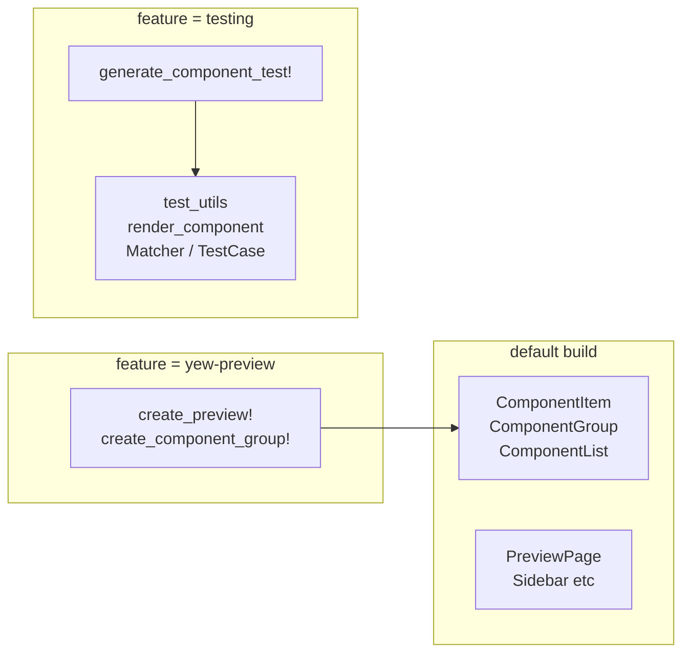
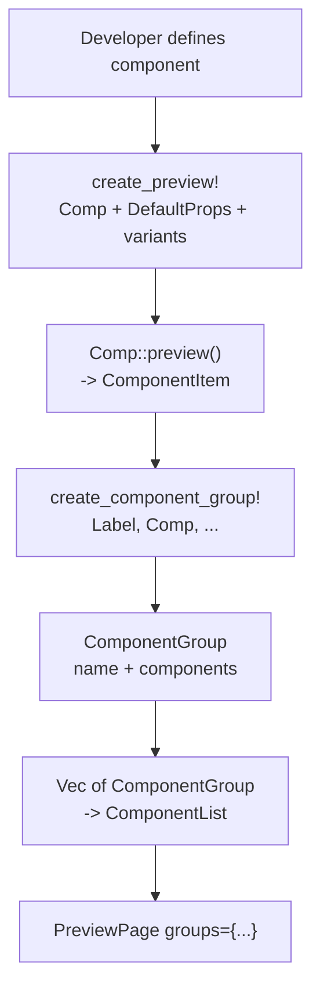
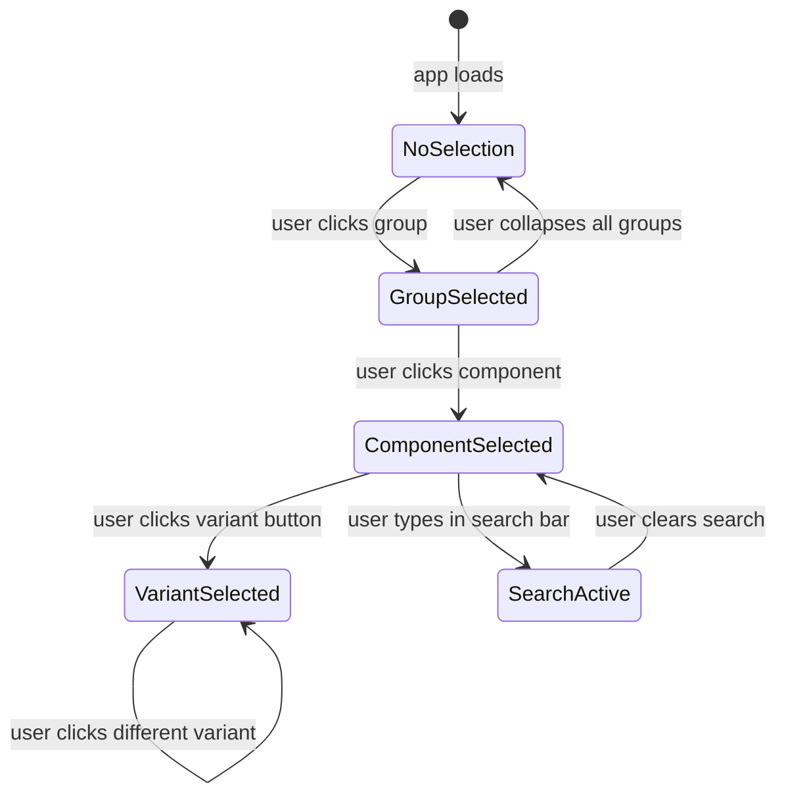

# Architecture

← [[index]]

## Crate Layout



```
yew-preview/                  ← workspace root
├── crates/
│   └── yew-preview/          ← library crate (published)
│       └── src/
│           ├── lib.rs         ← public re-exports & prelude
│           ├── macros.rs      ← all macro definitions
│           ├── preview.rs     ← ComponentItem / ComponentGroup / ComponentList
│           ├── preview_page.rs
│           ├── sidebar.rs
│           ├── search_bar.rs
│           ├── search_results.rs
│           ├── component_preview.rs
│           ├── component_selector.rs
│           ├── component_group.rs  ← GroupSelector
│           ├── component_item.rs
│           ├── component_list.rs
│           ├── group_selector.rs
│           ├── config_panel.rs
│           └── main_content.rs
│           └── test_utils/    ← feature-gated testing helpers
└── examples/
    └── yew-preview-example/  ← trunk WASM app
```

## Feature Flags

| Flag | Purpose |
|---|---|
| *(none)* | Core data types and UI components only |
| `yew-preview` | Enables preview macros (used in consumer crates) |
| `testing` | Enables `test_utils`, `render_component`, `Matcher` |

## Feature Flag Graph



## Data Flow



## State Management in `PreviewPage`

`PreviewPage` owns all interactive state via `use_state` hooks:

- `selected_group: Option<String>`
- `selected_component: Option<String>`
- `selected_variant: usize`
- `search_query: String`
- `sidebar_open: bool`

Child components receive these values as props and fire callbacks (`on_group_select`, `on_component_select`, etc.) to update parent state. This is standard Yew top-down data flow.



## Testing Architecture

The `testing` feature adds a separate sub-module `test_utils/` with:

- `Matcher` — assertion enum
- `TestCase` — named set of matchers
- `render_component<C>()` — async SSR render via `yew::LocalServerRenderer`
- `matchers.rs` — `matches()` implementation (string-based HTML matching)
- `helpers.rs` — ergonomic constructor functions

`generate_component_test!` produces a `#[tokio::test]` that wires these together so every `TestCase` embedded via `create_preview_with_tests!` is exercised automatically.

## Design Decisions

**Feature-gated previews** — Preview code never ships to end users. Consumer crates gate their preview modules on the `yew-preview` feature so release builds are unaffected.

**Macro-heavy API** — `create_preview!` eliminates boilerplate for the common case (name + props variants). The generated `::preview()` function is a stable contract the browser UI depends on.

**String-based test matchers** — SSR output is plain HTML text; matching against strings avoids a full DOM and keeps test dependencies minimal. The tradeoff is that matchers are less precise than CSS-selector queries on a live DOM.
