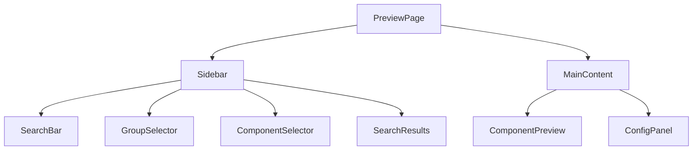
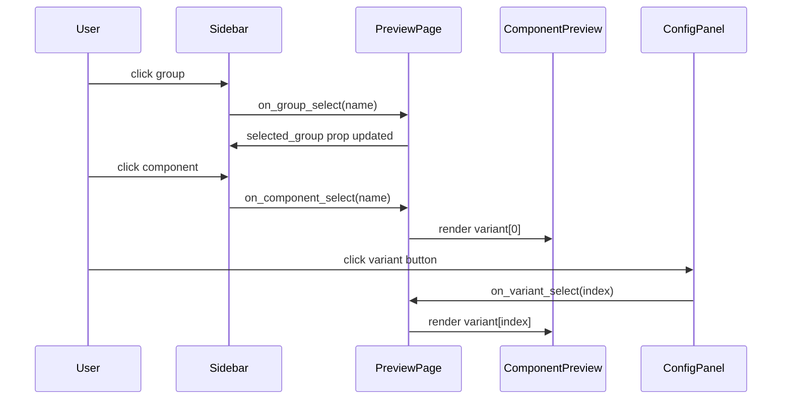

# UI Components

← [[index]]

All Yew components that make up the preview browser. They live in `crates/yew-preview/src/`.

## Component Hierarchy



## State & Callback Flow



## `PreviewPage`

The root component. Compose the entire browser from groups.

```rust
html! {
    <PreviewPage groups={groups} />
}
```

**Props:**

| Prop | Type | Description |
|---|---|---|
| `groups` | `ComponentList` | All component groups to display |

**Internal state:**

- Selected group name
- Selected component name
- Selected variant index
- Search query string
- Sidebar open/closed

## `Sidebar`

Left navigation panel. Contains `GroupSelector`, `ComponentSelector`, and `SearchBar`.

Rendered automatically by `PreviewPage`. Not usually used directly.

## `GroupSelector`

Collapsible tree of groups. Each group expands to show its component list. Clicking a group or component fires selection callbacks.

## `ComponentSelector`

Flat list of `ComponentItem` names for the currently selected group.

## `ComponentPreview`

Renders the selected variant's `Html` inside a checkerboard-background preview box.

## `ConfigPanel`

Row of buttons — one per variant name — that switch the active variant inside `ComponentPreview`.

## `SearchBar`

Controlled text input. Fires an `on_search: Callback<String>` on every keystroke.

**Props:**

| Prop | Type | Description |
|---|---|---|
| `placeholder` | `String` | Placeholder text |
| `on_search` | `Callback<String>` | Called with the current query |

## `SearchResults`

Displays components matching the current search query, grouped by their parent group name. Clicking a result navigates to that component.

## Data Types

```
ComponentList = Vec<ComponentGroup>

ComponentGroup {
    name: String,
    components: Vec<ComponentItem>,
}

ComponentItem {
    name: String,
    render: Vec<(String, Html)>,   // (variant name, rendered html)
    test_cases: Vec<TestCase>,
}
```

See [[testing]] for `TestCase` and [[macros]] for how these are produced.
