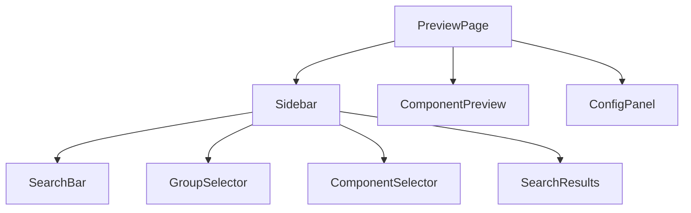
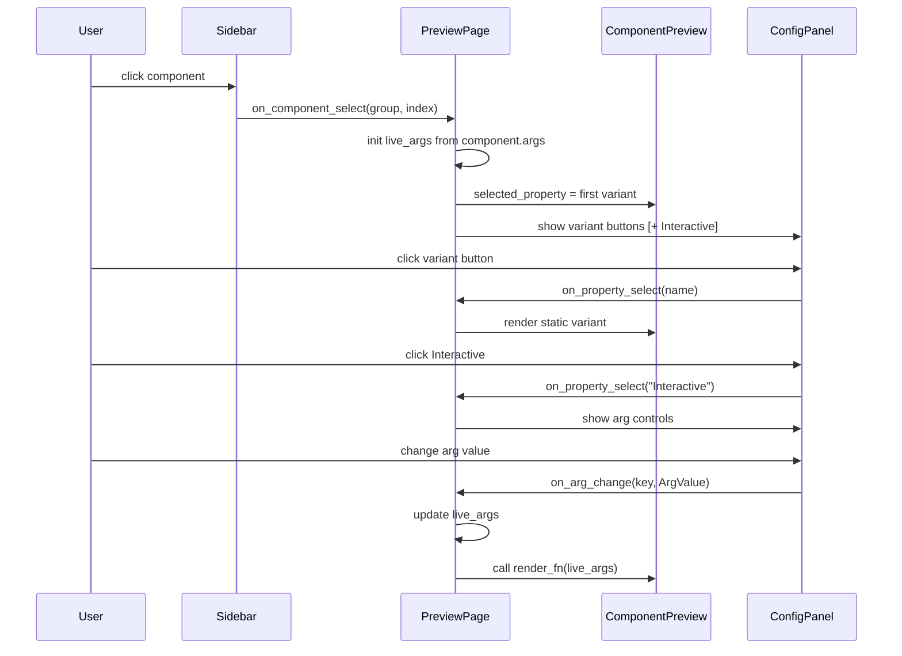

# UI Components

← [[index]]

All Yew components that make up the preview browser. They live in `crates/yew-preview/src/`.

## Component Hierarchy



## State & Callback Flow



## `PreviewPage`

The root component. Compose the entire browser from groups.

```rust
html! { <PreviewPage groups={groups} /> }
```

**Props:**

| Prop | Type | Description |
|---|---|---|
| `groups` | `ComponentList` | All component groups to display |

**Internal state:**

| State | Type | Description |
|---|---|---|
| `selected_group` | `Option<usize>` | Currently expanded group |
| `selected_component` | `Option<SelectedComponent>` | Selected group + component indices |
| `selected_property` | `Option<String>` | Active variant name or `"Interactive"` |
| `live_args` | `Vec<(String, ArgValue)>` | Current arg values for interactive mode |
| `search_query` | `String` | Current search input |
| `is_sidebar_visible` | `bool` | Sidebar collapsed state |

## `ComponentPreview`

Renders the active variant inside a checkerboard-background preview box.

- When `selected_property == "Interactive"` and the item has `args`: calls `render_fn(&live_args)` to produce fresh `Html`.
- Otherwise: looks up the matching entry in `item.render` and displays the pre-rendered `Html`.

## `ConfigPanel`

Bottom bar that switches between variants and exposes arg controls.

- Shows one button per static variant from `item.render`.
- Adds a blue **Interactive** button when the component has `args`.
- When **Interactive** is selected: renders an input control for each arg below the buttons.

| `ArgValue` variant | Control rendered |
|---|---|
| `Text(String)` | `<input type="text">` |
| `Bool(bool)` | `<input type="checkbox">` |
| `Int(i64)` | `<input type="number">` |
| `IntRange(val, min, max)` | `<input type="range">` + value label |
| `Float(f64)` | `<input type="number" step="0.1">` |

## `GroupSelector`

Collapsible tree of groups. Each group expands to show its component list. Clicking a component fires `on_component_select(group_index, comp_index)`.

## `ComponentSelector`

Flat list of `ComponentItem` names for the currently selected group.

## `SearchBar`

Controlled text input. Fires `on_search: Callback<String>` on every keystroke.

## `SearchResults`

Displays components matching the current search query across all groups. Clicking a result navigates directly to that component.

## Data Types

```
ComponentList = Vec<ComponentGroup>

ComponentGroup {
    name: String,
    components: Vec<ComponentItem>,
}

ComponentItem {
    name: String,
    render: Vec<(String, Html)>,         // static snapshot variants
    args: Option<InteractiveArgs>,        // live-editing args, None for static-only
    test_cases: Vec<TestCase>,
}

InteractiveArgs {
    values: Vec<(String, ArgValue)>,
    render_fn: Rc<dyn Fn(&[(String, ArgValue)]) -> Html>,
}

ArgValue = Bool(bool) | Int(i64) | IntRange(i64, i64, i64) | Float(f64) | Text(String)
```

See [[interactive]] for `ArgValue` usage and [[testing]] for `TestCase`.
