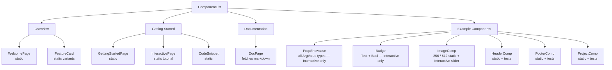

# Examples

← [[index]]

The `examples/yew-preview-example/` directory is a complete Trunk WASM application that exercises all library features, including interactive previews.

## Running the Example

```bash
cd examples/yew-preview-example
trunk serve
```

Open `http://localhost:8080`.

## Group Structure



## Pages

### `WelcomePage`

Hero section and feature grid. Demonstrates a documentation-style page component with no dynamic state.

### `GettingStartedPage`

Four-step guide using `CodeSnippet` components inline. Shows how to wire yew-preview into a new project.

### `InteractivePage`

Tutorial that documents all `ArgValue` types — table of variants, per-type code snippets, a full `create_interactive_preview!` example, and a mixed static+interactive example. Points to `PropShowcase` for a live demo.

### `DocPage`

Fetches Markdown files from GitHub (configured via `YEWPREVIEW_SOURCE_URL` env var at build time), preprocesses `[[wiki-link]]` syntax, and renders with `pulldown-cmark`. Demonstrates async data fetching in a preview component.

## Interactive Components

### `PropShowcase`

Exercises every `ArgValue` type in one component:

| Arg | Type | Control |
|---|---|---|
| `label` | `Text` | text input |
| `enabled` | `Bool` | checkbox |
| `count` | `Int` | number |
| `size` | `IntRange(1, 200)` | slider → progress bar |
| `ratio` | `Float` | number → opacity swatch |

Uses a manual `Preview` impl (`render: vec![], args: Some(...)`). The UI auto-selects **Interactive** on load.

### `Badge`

```rust
pub struct BadgeProps {
    pub label: AttrValue,
    pub color: AttrValue,
    pub rounded: bool,
}
```

Uses `create_interactive_preview!` with `Text`, `Text`, and `Bool` args. Pure interactive — no static snapshots.

### `ImageComp`

```rust
pub struct ImageCompProps {
    pub src: String,
    pub size: u32,
}
```

Demonstrates **mixed static + interactive**: two static snapshot tabs (256px, 512px) plus an **Interactive** tab with a `src` text input and a `size` slider (`IntRange(256, 24, 1024)`). Implemented with a manual `Preview` impl that populates both `render` and `args`.

## Static Components with Tests

### `HeaderComp`

Variants: *Default*, *Hello*, *Goodbye*. Uses `create_preview_with_tests!` and `generate_component_test!`.

### `FooterComp`

Footer counterpart to `HeaderComp`. Two auto-generated tokio tests (full props + empty).

### `ProjectComp`

```rust
pub struct ProjectProps {
    pub title: String,
    pub description: String,
    pub url: String,
    pub repo: Option<String>,
}
```

Variants: *YewPreview*, *Konnektoren*, *No Repo*, *Long Description*. Two separate `generate_component_test!` calls — one for the full case, one for `repo: None`.

## What to Explore

1. **Sidebar → Example Components → PropShowcase** — click **Interactive**, change any control
2. **Sidebar → Example Components → ImageComp** — switch between 256, 512, and Interactive tabs; drag the size slider
3. **Sidebar → Getting Started → InteractivePage** — read the arg type reference
4. **Read `examples/yew-preview-example/src/components/badge.rs`** — minimal `create_interactive_preview!` usage
5. **Read `examples/yew-preview-example/src/components/image.rs`** — manual `Preview` impl combining static and interactive

## Further Reading

- All macro options → [[macros]]
- `ArgValue` types in detail → [[interactive]]
- How `ConfigPanel` renders controls → [[components]]
- How test cases run → [[testing]]
