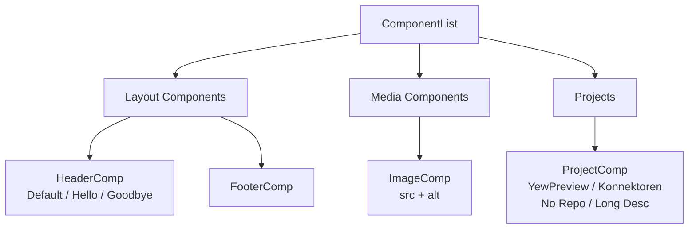

# Examples

← [[index]]

The `examples/yew-preview-example/` directory is a complete Trunk WASM application that exercises all library features.

## Running the Example

```bash
cd examples/yew-preview-example
trunk serve
```

Open `http://localhost:8080`.

## Components Demonstrated

### `HeaderComp`

```rust
#[derive(Properties, PartialEq)]
pub struct HeaderProps {
    pub title: String,
}
```

Variants: *Default*, *Hello*, *Goodbye*

Test cases: `h1` element exists, border style, padding, title text content.

Uses `create_preview_with_tests!` and `generate_component_test!`.

### `FooterComp`

Footer counterpart to `HeaderComp`. Same pattern — useful for comparing layout-level components side by side in the browser.

### `ImageComp`

```rust
pub struct ImageProps {
    pub src: String,
    pub alt: String,
}
```

Demonstrates media component preview with `img` element and alt text matchers.

### `ProjectComp`

```rust
pub struct ProjectProps {
    pub title: String,
    pub description: String,
    pub url: String,
    pub repo: Option<String>,   // optional
}
```

Variants: *YewPreview*, *Konnektoren*, *No Repo* (repo is `None`), *Long Description*

Two separate `generate_component_test!` calls: one for the full props case, one for the no-repo case.

## Group Structure

```rust
let groups = vec![
    create_component_group!("Layout Components", HeaderComp, FooterComp),
    create_component_group!("Media Components", ImageComp),
    create_component_group!("Projects", ProjectComp),
];
```



This produces a three-group sidebar. Expanding each group shows the component list.

## What to Explore

1. Open the sidebar → select *Layout Components* → click *HeaderComp*
2. Switch variants with the config panel buttons at the bottom
3. Use the search bar to filter across all groups
4. Read `examples/yew-preview-example/src/components/header.rs` to see the full `create_preview_with_tests!` call alongside the component definition

## Further Reading

- How the macros work → [[macros]]
- How test cases run → [[testing]]
- How `PreviewPage` orchestrates the UI → [[components]]
