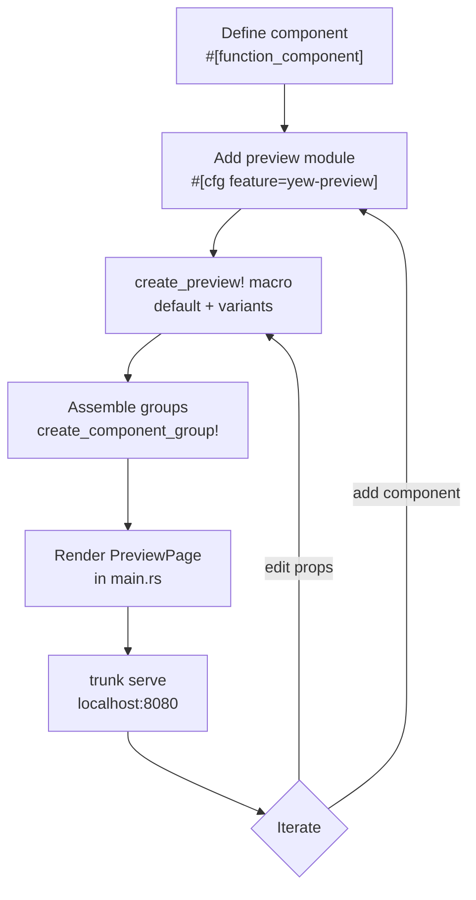

# Getting Started

← [[index]]

## 1. Add the Dependency

```toml
# Cargo.toml
[dependencies]
yew = { version = "0.21", features = ["csr"] }
yew-preview = { git = "https://github.com/chriamue/yew-preview" }

[features]
default = []
yew-preview = []
```

The `yew-preview` feature flag keeps all preview code out of production builds.

## 2. Add a Preview to a Component

Wrap preview code in `#[cfg(feature = "yew-preview")]` so it only compiles when needed:

```rust
use yew::prelude::*;

#[derive(Properties, PartialEq)]
pub struct ButtonProps {
    pub label: String,
    pub disabled: bool,
}

#[function_component(Button)]
pub fn button(props: &ButtonProps) -> Html {
    html! {
        <button disabled={props.disabled}>{props.label.clone()}</button>
    }
}

#[cfg(feature = "yew-preview")]
mod preview {
    use super::*;
    use yew_preview::prelude::*;

    yew_preview::create_preview!(
        Button,
        ButtonProps { label: "Click me".to_string(), disabled: false },
        ("Disabled", ButtonProps { label: "Can't click".to_string(), disabled: true }),
    );
}
```

See [[macros]] for the full macro syntax.

## 3. Create the Preview App

```rust
// src/main.rs
use yew::prelude::*;
use yew_preview::prelude::*;

#[function_component(App)]
pub fn app() -> Html {
    let groups = vec![
        yew_preview::create_component_group!("Buttons", Button),
    ];
    html! { <PreviewPage groups={groups} /> }
}

fn main() {
    yew::Renderer::<App>::new().render();
}
```

## 4. Run

```bash
trunk serve
```

Open `http://localhost:8080`. The sidebar lists your groups and components; clicking a component shows its variants.

## Workflow Overview



## Next Steps

- Add test cases to catch regressions → [[testing]]
- Group related components → [[macros#create_component_group!]]
- Understand the UI layout → [[components]]
