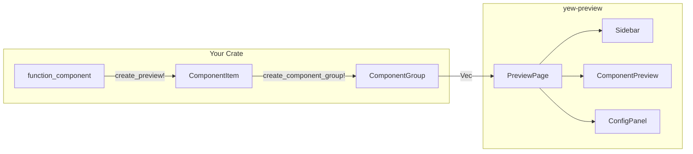

# YewPreview

> A lightweight Rust library for interactive component previews in Yew applications — like Storybook, but for Rust.

## Quick Navigation

- [[getting-started]] — Add to your project and run your first preview
- [[macros]] — Reference for `create_preview!`, `create_component_group!` and friends
- [[components]] — UI components that make up the preview browser
- [[testing]] — Built-in test utilities and matchers
- [[architecture]] — How the library is structured internally
- [[examples]] — Annotated walkthrough of the bundled example

## What is YewPreview?

YewPreview lets you register multiple prop variants for any Yew `#[function_component]` and browse them in an interactive browser served by `trunk serve`. Preview code lives behind a feature flag (`yew-preview`) so it compiles out of production builds.

## Key Concepts

| Concept | Description |
|---|---|
| `ComponentItem` | One component with named variants |
| `ComponentGroup` | A labelled collection of `ComponentItem`s |
| `ComponentList` | `Vec<ComponentGroup>` — the full tree |
| `PreviewPage` | Root Yew component that renders the browser |
| `Matcher` | Assertion type used in test cases |
