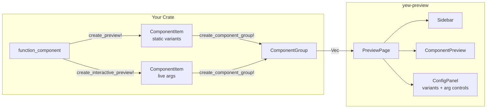

# YewPreview

> A lightweight Rust library for interactive component previews in Yew applications — like Storybook, but for Rust.

## Quick Navigation

- [[getting-started]] — Add to your project and run your first preview
- [[macros]] — Reference for all macros including `create_interactive_preview!`
- [[interactive]] — Live prop editing with `ArgValue` and `InteractiveArgs`
- [[components]] — UI components that make up the preview browser
- [[testing]] — Built-in test utilities and matchers
- [[serve]] — Native preview server via axum (no trunk needed)
- [[catalog]] — Generate a static HTML catalog of all components
- [[architecture]] — How the library is structured internally
- [[examples]] — Annotated walkthrough of the bundled example

## What is YewPreview?

YewPreview lets you register multiple prop variants for any Yew `#[function_component]` and browse them in an interactive browser served by `trunk serve`. Components can also expose live-editable args that re-render instantly without a recompile. Preview code lives behind a feature flag so it compiles out of production builds.

## Key Concepts

| Concept | Description |
|---|---|
| `ComponentItem` | One component with named variants and optional live args |
| `ComponentGroup` | A labelled collection of `ComponentItem`s |
| `ComponentList` | `Vec<ComponentGroup>` — the full tree |
| `PreviewPage` | Root Yew component that renders the browser |
| `ArgValue` | Runtime-typed arg value: `Text`, `Bool`, `Int`, `IntRange`, `Float` |
| `InteractiveArgs` | Arg values + render closure stored in `ComponentItem` |
| `Matcher` | Assertion type used in test cases |
