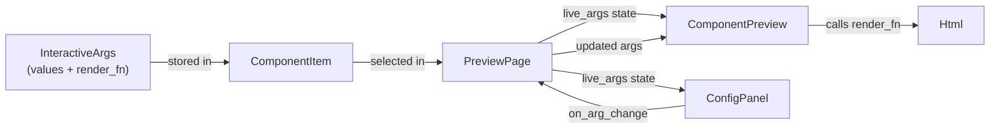

# Interactive Previews

← [[index]]

Interactive previews let you edit component props live in the browser — no recompile needed. When a component is selected, click the **Interactive** tab in the config panel to see controls for each declared arg.

## How It Works



The render closure is called every time any arg changes, producing fresh `Html` without a page reload.

## `ArgValue` Types

| Variant | Control | Accessor | Use for |
|---|---|---|---|
| `ArgValue::Text(String)` | text input | `get_text(args, "key")` | labels, URLs, any string |
| `ArgValue::Bool(bool)` | checkbox | `get_bool(args, "key")` | flags, toggles |
| `ArgValue::Int(i64)` | number input | `get_int(args, "key")` | unconstrained integers |
| `ArgValue::IntRange(value, min, max)` | slider | `get_int(args, "key")` | bounded sizes, counts |
| `ArgValue::Float(f64)` | number input | `get_float(args, "key")` | opacity, ratios |

`get_int` works for both `Int` and `IntRange` — the accessor is identical.

## `create_interactive_preview!`

Use when a component has **only** interactive variants (no static snapshots).

```rust
use yew_preview::prelude::*;

create_interactive_preview!(
    Badge,
    args: [
        ("label",   ArgValue::Text("Hello".to_string())),
        ("color",   ArgValue::Text("#0969da".to_string())),
        ("rounded", ArgValue::Bool(true)),
    ],
    |args| {
        let label   = get_text(args, "label");
        let color   = get_text(args, "color");
        let rounded = get_bool(args, "rounded");
        html! {
            <Badge label={AttrValue::from(label)} color={AttrValue::from(color)} rounded={rounded} />
        }
    }
);
```

The macro generates a `Preview` impl with `render: vec![]` and `args: Some(...)`. The UI auto-selects the **Interactive** tab on load.

## Static Variants + Interactive

Populate both `render` and `args` in a manual `Preview` impl to get fixed snapshot tabs alongside **Interactive**. The static variants appear as buttons; **Interactive** is added automatically by the UI when `args` is `Some`.

```rust
impl Preview for ImageComp {
    fn preview() -> ComponentItem {
        use std::rc::Rc;
        ComponentItem {
            name: "ImageComp".to_string(),
            render: vec![
                ("256".to_string(), html! { <ImageComp src={SRC} size={256u32} /> }),
                ("512".to_string(), html! { <ImageComp src={SRC} size={512u32} /> }),
            ],
            args: Some(InteractiveArgs {
                values: vec![
                    ("src".to_string(),  ArgValue::Text(SRC.to_string())),
                    ("size".to_string(), ArgValue::IntRange(256, 24, 1024)),
                ],
                render_fn: Rc::new(|args| {
                    let src  = get_text(args, "src");
                    let size = get_int(args, "size") as u32;
                    html! { <ImageComp src={src} size={size} /> }
                }),
            }),
            test_cases: vec![],
        }
    }
}
```

The config panel shows **256 | 512 | Interactive**. The first static variant is selected by default.

## Slider (`IntRange`)

`IntRange(value, min, max)` renders as an HTML range input with a live value readout.

```rust
("size", ArgValue::IntRange(256, 24, 1024))
// → slider from 24 to 1024, starting at 256
// read with: get_int(args, "size") as u32
```

## Live Demo

Open **Example Components → PropShowcase** in the sidebar. It demonstrates all five arg types simultaneously — edit any control and the component updates instantly.

See also [[macros#create_interactive_preview!]] and [[examples]].
