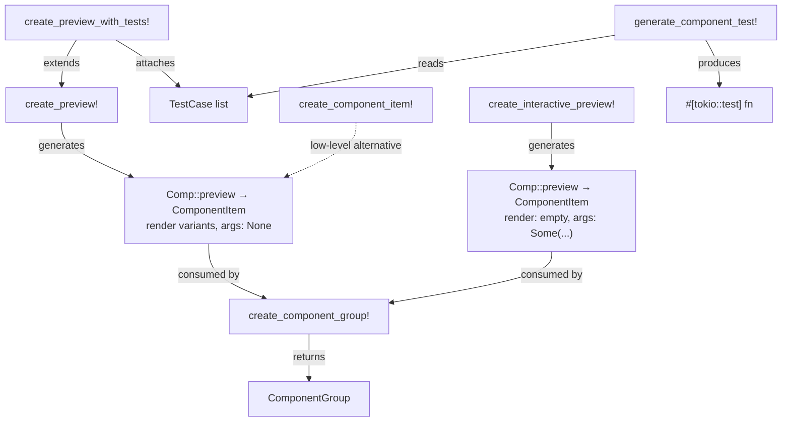

# Macros Reference

← [[index]]

YewPreview is macro-driven. All macros live in `crates/yew-preview/src/macros.rs`.

## Macro Relationships



## `create_preview!`

Registers static preview variants for a component. Generates a `Preview` impl with `args: None`.

```rust
yew_preview::create_preview!(
    ComponentName,
    DefaultProps { .. },
    ("Variant Label", VariantProps { .. }),
    // more variants...
);
```

| Argument | Type | Description |
|---|---|---|
| `ComponentName` | ident | The Yew `#[function_component]` type |
| `DefaultProps` | expr | Props value for the default variant |
| `("Label", props)` | tuple | Named variant — zero or more |

## `create_preview_with_tests!`

Same as `create_preview!` but adds test cases validated by [[testing#Matchers]].

```rust
yew_preview::create_preview_with_tests!(
    component: MyComponent,
    default_props: MyComponentProps { text: "hello".to_string() },
    variants: [
        ("World", MyComponentProps { text: "world".to_string() }),
    ],
    tests: [
        ("has text", Matcher::HasText("hello".to_string())),
    ]
);
```

Test cases appear in `ComponentItem::test_cases` and can be run with `generate_component_test!`.

## `create_interactive_preview!`

Registers a live-editable preview. The component re-renders instantly as args change in the browser — no recompile needed. See [[interactive]] for full documentation.

```rust
yew_preview::create_interactive_preview!(
    Badge,
    args: [
        ("label",   ArgValue::Text("Hello".to_string())),
        ("color",   ArgValue::Text("#0969da".to_string())),
        ("rounded", ArgValue::Bool(true)),
        ("size",    ArgValue::IntRange(32, 8, 128)),
        ("ratio",   ArgValue::Float(1.0)),
    ],
    |args| {
        let label   = get_text(args, "label");
        let color   = get_text(args, "color");
        let rounded = get_bool(args, "rounded");
        html! {
            <Badge label={AttrValue::from(label)} color={AttrValue::from(color)} rounded={rounded} />
        }
    }
);
```

| Section | Description |
|---|---|
| `$component` | The component type — receives a `Preview` impl |
| `args: [...]` | Initial `(name, ArgValue)` pairs — one per editable prop |
| `\|args\|` closure | Render function called on every arg change |

Generates `ComponentItem { render: vec![], args: Some(...) }`. The UI auto-selects the **Interactive** tab.

To combine static snapshot variants with interactive, implement `Preview` manually — see [[interactive#Static Variants + Interactive]].

## `create_component_item!`

Low-level macro used internally. Prefer `create_preview!` unless you need direct control.

```rust
let item = yew_preview::create_component_item!(
    "MyComponent",
    MyComponent,
    vec![("Default".to_string(), html! { <MyComponent text="hi" /> })]
);
```

## `create_component_group!`

Creates a `ComponentGroup` from a label and one or more `ComponentItem` values.

```rust
let group = yew_preview::create_component_group!(
    "UI Components",
    Button::preview(),
    Card::preview(),
    Badge::preview(),
);
```

Returns a `ComponentGroup { name, components }`. Collect several into a `Vec` to pass to `PreviewPage`.

## `generate_component_test!`

Generates a `#[tokio::test]` or `#[wasm_bindgen_test]` function that renders a component server-side and runs all its matchers.

```rust
#[cfg(test)]
mod tests {
    use super::*;
    yew_preview::generate_component_test!(tokio, MyComponent, MyComponentProps {
        text: "hello".to_string(),
    });
}
```

Requires the `testing` feature. See [[testing]] for details.
