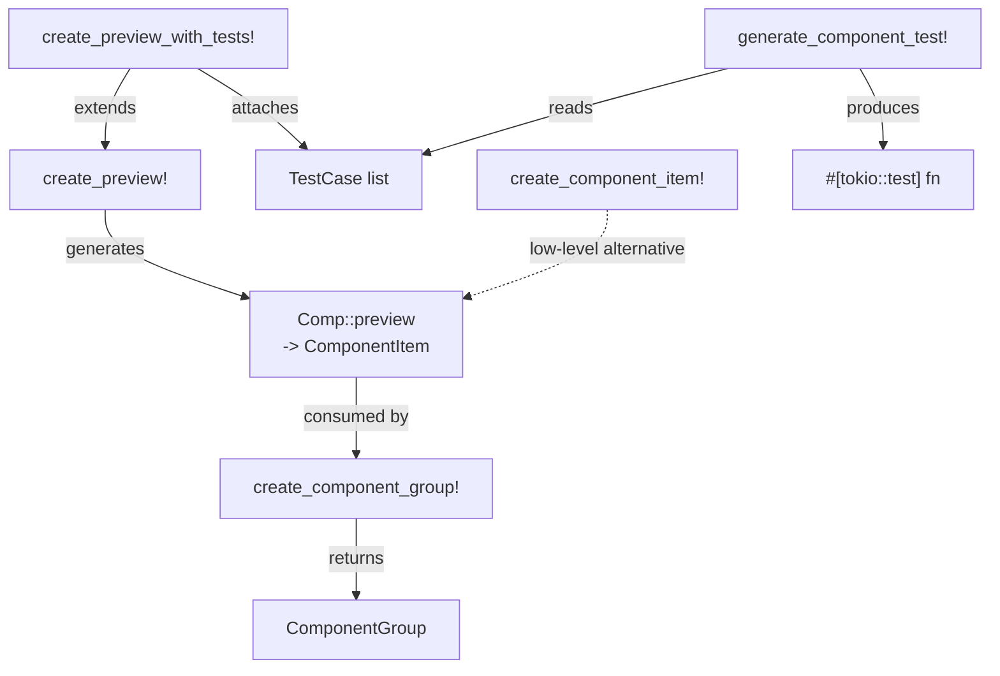

# Macros Reference

← [[index]]

YewPreview is macro-driven. All macros live in `crates/yew-preview/src/macros.rs`.

## Macro Relationships



## `create_preview!`

Registers preview variants for a component. Generates a `preview()` associated function that returns a `ComponentItem`.

```rust
yew_preview::create_preview!(
    ComponentName,
    DefaultProps { .. },
    ("Variant Label", VariantProps { .. }),
    // more variants...
);
```

| Argument | Type | Description |
|---|---|---|
| `ComponentName` | ident | The Yew `#[function_component]` type |
| `DefaultProps` | expr | Props value for the default variant |
| `("Label", props)` | tuple | Named variant — zero or more |

The macro also derives `ComponentName::preview() -> ComponentItem`.

## `create_preview_with_tests!`

Same as `create_preview!` but adds test cases validated by [[testing#Matchers]].

```rust
yew_preview::create_preview_with_tests!(
    MyComponent,
    MyComponentProps { text: "hello".to_string() },
    [
        ("has text", vec![yew_preview::test_utils::has_text("hello")]),
        ("has class", vec![yew_preview::test_utils::has_class("my-class")]),
    ],
    ("Variant", MyComponentProps { text: "world".to_string() }),
);
```

Test cases appear in `ComponentItem::test_cases` and can be run with `generate_component_test!`.

## `create_component_item!`

Low-level macro used internally. Prefer `create_preview!` unless you need direct control.

```rust
let item = yew_preview::create_component_item!(
    MyComponent,
    vec![
        ("Default".to_string(), html! { <MyComponent text="hi" /> }),
    ]
);
```

## `create_component_group!`

Creates a `ComponentGroup` from a label and one or more component types that expose a `preview()` method.

```rust
let group = yew_preview::create_component_group!(
    "UI Components",
    Button,
    Card,
    Badge,
);
```

Returns a `ComponentGroup { name, components }`. Collect several into a `Vec` to pass to `PreviewPage`.

## `generate_component_test!`

Generates a `#[tokio::test]` / `#[wasm_bindgen_test]` function that renders a component server-side and runs all its matchers.

```rust
#[cfg(test)]
mod tests {
    use super::*;
    yew_preview::generate_component_test!(MyComponent, MyComponentProps {
        text: "hello".to_string(),
    });
}
```

Requires the `testing` feature. See [[testing]] for details.
