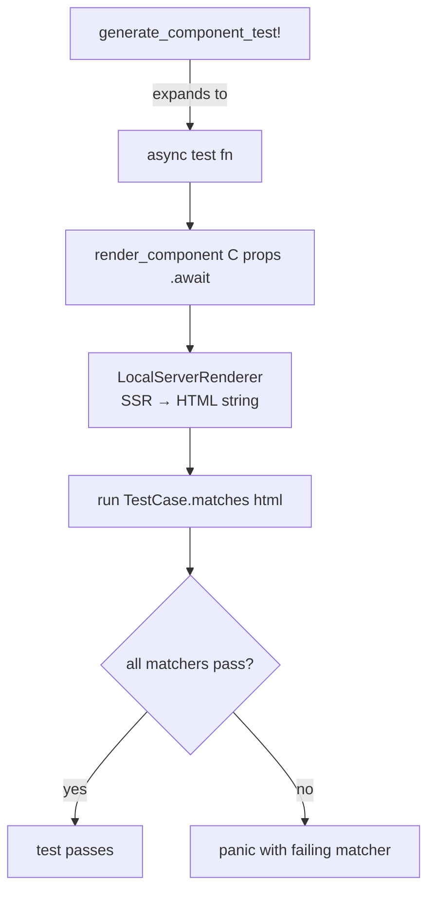
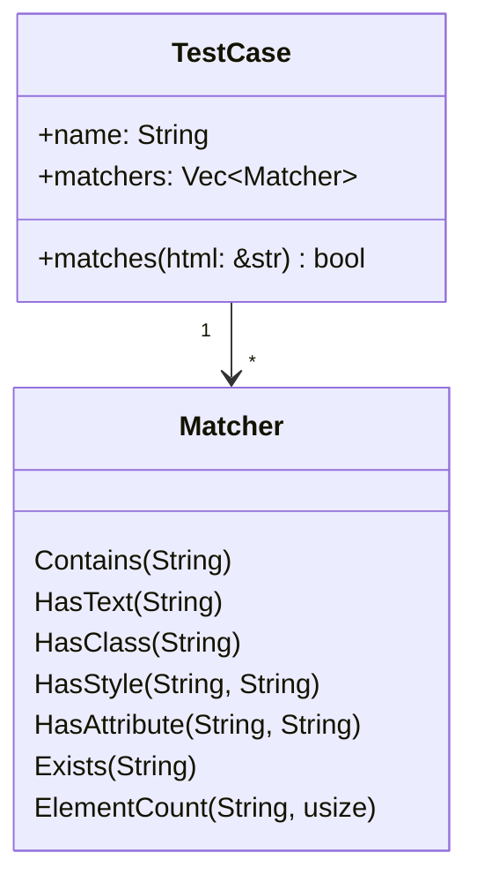

# Testing

← [[index]]

YewPreview ships built-in test utilities behind the `testing` feature flag. They use Yew's `LocalServerRenderer` for server-side rendering so tests run without a browser.

## Test Execution Flow



## Enabling the Testing Feature

```toml
[dev-dependencies]
yew-preview = { git = "https://github.com/chriamue/yew-preview", features = ["testing"] }
```

## Matchers

`Matcher` is an enum that describes one assertion against rendered HTML.



| Variant | Checks |
|---|---|
| `Contains(String)` | Raw HTML contains substring |
| `HasText(String)` | Visible text content contains value |
| `HasClass(String)` | Any element has CSS class |
| `HasStyle(String, String)` | Any element has inline style `property: value` |
| `HasAttribute(String, String)` | Any element has `attribute="value"` |
| `Exists(String)` | CSS selector matches at least one element |
| `ElementCount(String, usize)` | CSS selector matches exactly N elements |

### Helper Functions

```rust
use yew_preview::test_utils::*;

has_text("Hello")                    // Matcher::HasText
has_class("btn-primary")             // Matcher::HasClass
has_style("color", "red")            // Matcher::HasStyle
has_attribute("disabled", "true")    // Matcher::HasAttribute
exists("h1")                         // Matcher::Exists
```

## TestCase

Groups matchers under a name.

```rust
TestCase {
    name: "has heading".to_string(),
    matchers: vec![exists("h1"), has_text("Welcome")],
}
```

`test_case.matches(&html_string)` returns `true` if **all** matchers pass.

## Writing Tests with `create_preview_with_tests!`

Embed test cases directly in the preview declaration:

```rust
yew_preview::create_preview_with_tests!(
    HeaderComp,
    HeaderProps { title: "Test".to_string() },
    [
        ("renders h1",   vec![exists("h1")]),
        ("has title",    vec![has_text("Test")]),
        ("has border",   vec![has_style("border", "1px solid black")]),
    ],
    ("Alt title", HeaderProps { title: "Alt".to_string() }),
);
```

## Running Tests with `generate_component_test!`

Generates a full async test function:

```rust
#[cfg(test)]
mod tests {
    use super::*;
    yew_preview::generate_component_test!(HeaderComp, HeaderProps {
        title: "Test".to_string(),
    });
}
```

This calls `render_component::<HeaderComp>(props).await`, then runs every matcher from the component's `test_cases`. Failures are reported per test case.

## `render_component`

Low-level async function for rendering a component to an HTML string:

```rust
let html = yew_preview::test_utils::render_component::<MyComp>(props).await;
assert!(html.contains("expected text"));
```

Useful when you want to write custom assertions outside of the matcher framework.
